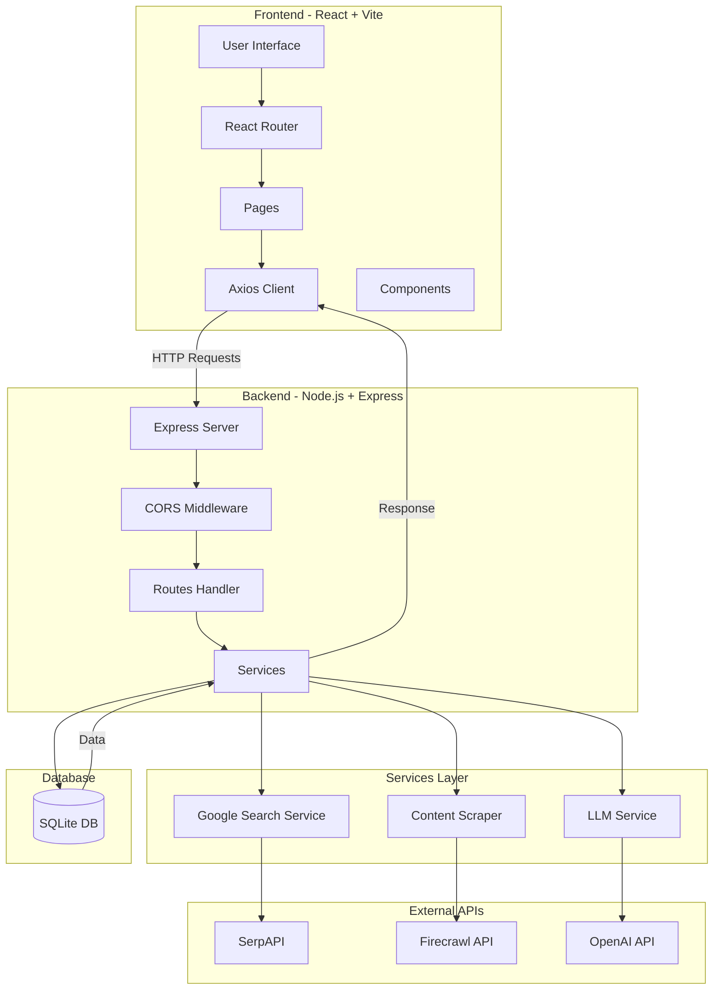
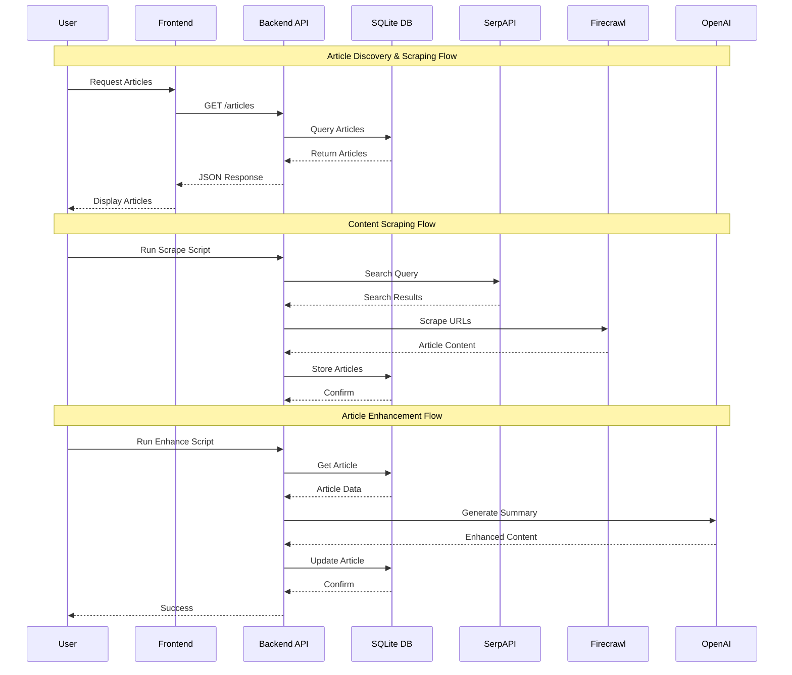

# BeyondChats Assignment for Full Stack Web Developer Intern 

Hi, I am saurabh and this is my submission for the BeyondChats assignment for the role of Full Stack Developer Intern.

## 🌐 Live Demo

**Frontend:** [https://beyondchatsassisgnment.netlify.app/](https://beyondchatsassisgnment.netlify.app/)

## 🏗️ Architecture

### System Architecture Diagram



### Data Flow Diagram



## 🛠️ Tech Stack

### Frontend
- **React 19** - UI library
- **Vite** - Build tool and dev server
- **Tailwind CSS** - Utility-first CSS framework
- **React Router** - Client-side routing
- **Axios** - HTTP client
- **Lucide React** - Icon library
- **React Markdown** - Markdown rendering

### Backend
- **Node.js** - Runtime environment
- **Express.js** - Web framework
- **SQLite (better-sqlite3)** - Database
- **Axios** - HTTP client for external APIs
- **CORS** - Cross-origin resource sharing

### External Services
- **SerpAPI** - Google search results
- **Firecrawl** - Web scraping service
- **OpenAI GPT-4** - Content enhancement
- **Cheerio** - HTML parsing

## 📋 Prerequisites

Before you begin, ensure you have the following installed:
- **Node.js** (v18 or higher)
- **npm** or **yarn**
- **Git**

## 🔧 Local Setup Instructions

### 1. Clone the Repository

```bash
git clone <repository-url>
```

### 2. Backend Setup

#### Navigate to Backend Directory

```bash
cd backend
```

#### Install Dependencies

```bash
npm install
```

#### Configure Environment Variables

Create a `.env` file in the `backend` directory:

```env
# Server Configuration
PORT=3000
FRONTEND_URL=http://localhost:5173

# API Keys
OPENAI_API_KEY=your_openai_api_key_here
SERPAPI_KEY=your_serpapi_key_here
FIRECRAWL_API_KEY=your_firecrawl_api_key_here

# Database
DATABASE_PATH=./articles.db
```

#### Initialize Database

The database will be automatically created when you run the server for the first time.

#### Run Backend Server

```bash
npm start
```

The server will start on `http://localhost:3000`

### 3. Frontend Setup

#### Navigate to Frontend Directory

Open a new terminal and navigate to the frontend directory:

```bash
cd frontend
```

#### Install Dependencies

```bash
npm install
```

#### Configure Environment Variables

Create a `.env` file in the `frontend` directory:

```env
VITE_API_URL=http://localhost:3000
```

#### Run Frontend Development Server

```bash
npm run dev
```

The frontend will start on `http://localhost:5173`

### 4. Data Collection Scripts

#### Scrape Articles

To scrape articles from the web:

```bash
cd backend
npm run scrape
```

This will:
- Search for articles using SerpAPI
- Scrape content using Firecrawl
- Save raw articles to the database

#### Enhance Articles

To enhance articles with AI-generated summaries:

```bash
cd backend
npm run enhance
```

This will:
- Fetch articles from the database
- Generate enhanced summaries using OpenAI
- Update articles with improved content

#### Import Articles

To import articles from JSON:

```bash
cd backend
npm run import
```

## 📁 Project Structure

```
.
├── backend/
│   ├── src/
│   │   ├── server.js              # Express server setup
│   │   ├── config/
│   │   │   └── db.js              # SQLite database configuration
│   │   ├── services/
│   │   │   ├── googleSearch.js    # SerpAPI integration
│   │   │   ├── contentScraper.js  # Firecrawl scraping service
│   │   │   └── llmService.js      # OpenAI integration
│   │   └── scripts/
│   │       ├── scrape.js          # Article scraping script
│   │       ├── enhanceArticle.js  # Article enhancement script
│   │       └── importArticles.js  # Import from JSON
│   ├── data/
│   │   └── scraped_articles.json  # Scraped data storage
│   └── package.json
│
├── frontend/
│   ├── src/
│   │   ├── App.jsx                # Main application component
│   │   ├── main.jsx               # Application entry point
│   │   ├── pages/
│   │   │   ├── Home.jsx           # Home page with article grid
│   │   │   └── ArticleDetail.jsx  # Individual article view
│   │   ├── components/
│   │   │   ├── ArticleCard.jsx    # Article card component
│   │   │   ├── ArticleGrid.jsx    # Grid layout for articles
│   │   │   └── ui/                # Reusable UI components
│   │   ├── services/
│   │   │   └── api.js             # API client
│   │   └── lib/
│   │       └── utils.js           # Utility functions
│   └── package.json
│
└── README.md
```

## 🔌 API Endpoints

### GET /
- **Description**: API information and available endpoints
- **Response**: JSON with API details

### GET /health
- **Description**: Health check endpoint
- **Response**: `{ status: 'ok', timestamp: '...' }`

### GET /articles
- **Description**: Retrieve all articles
- **Response**: Array of article objects

### GET /articles/:id
- **Description**: Retrieve a single article by ID
- **Response**: Article object

### POST /articles
- **Description**: Create a new article
- **Body**: Article data
- **Response**: Created article

### PUT /articles/:id
- **Description**: Update an existing article
- **Body**: Updated article data
- **Response**: Updated article

### DELETE /articles/:id
- **Description**: Delete an article
- **Response**: Success message

## 🔑 Environment Variables

### Backend

| Variable | Description | Required |
|----------|-------------|----------|
| `PORT` | Server port number | No (default: 3000) |
| `FRONTEND_URL` | Frontend URL for CORS | No (default: *) |
| `OPENAI_API_KEY` | OpenAI API key for content enhancement | Yes |
| `SERPAPI_KEY` | SerpAPI key for Google search | Yes |
| `FIRECRAWL_API_KEY` | Firecrawl API key for web scraping | Yes |
| `DATABASE_PATH` | SQLite database file path | No (default: ./articles.db) |

### Frontend

| Variable | Description | Required |
|----------|-------------|----------|
| `VITE_API_URL` | Backend API URL | Yes |


## 🧪 Development

### Frontend Development

```bash
cd frontend
npm run dev      # Start dev server
npm run build    # Build for production
npm run preview  # Preview production build
npm run lint     # Run ESLint
```

### Backend Development

```bash
cd backend
npm start        # Start server
npm run scrape   # Scrape new articles
npm run enhance  # Enhance articles with AI
npm run import   # Import articles from JSON
```
